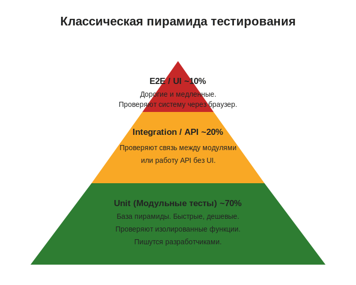
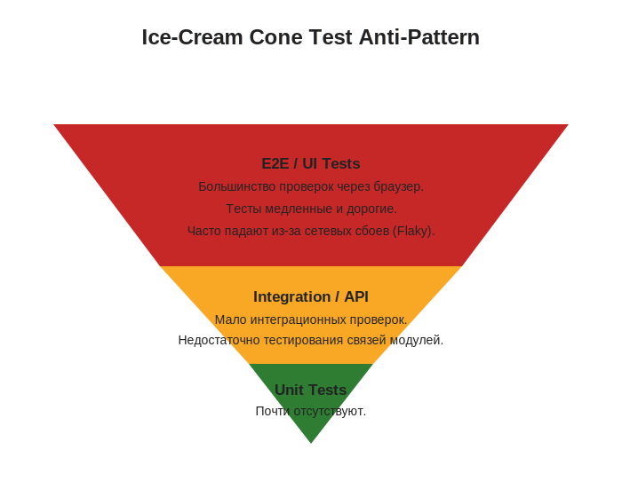
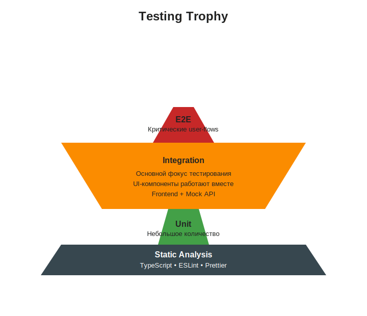
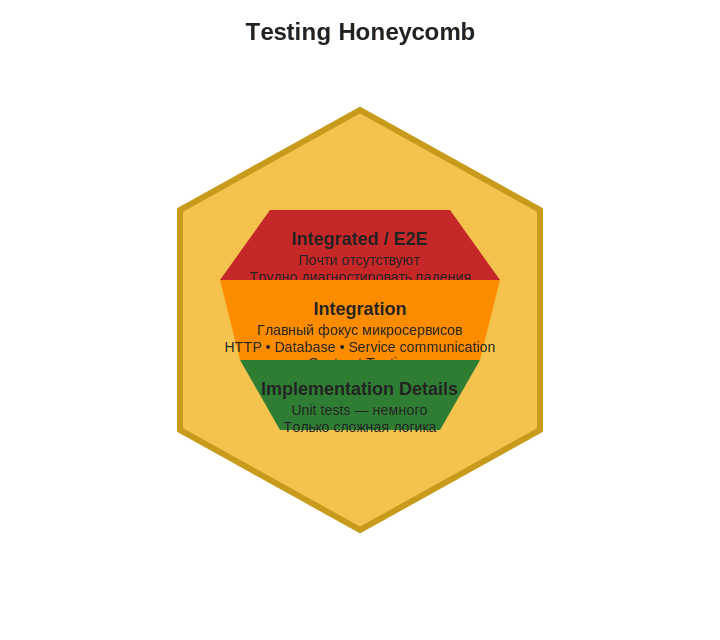

# Блок 2: Инженерия и написание тестов (База)
## Тема 5: Модели распределения тестов: Пирамиды, Трофеи и Соты

Любой проект имеет ограниченный бюджет и время. Если автоматизировать всё подряд через браузер (UI), тесты будут идти сутками. Если писать только Unit-тесты, мы не узнаем, работает ли система целиком. 

Для решения этой проблемы инженеры придумали **модели распределения тестов** — визуальные метафоры, которые показывают, в каких пропорциях нужно писать разные виды автотестов, чтобы получить максимум уверенности (Confidence) при минимуме затрат времени (ROI — Return on Investment) [[3](https://kentcdodds.com/blog/the-testing-trophy-and-testing-classifications)][[4](https://dev.to/matthiasbruns/a-test-automation-strategy-that-actually-works-abf)]. 

В 2026 году активно используются три основные модели.

---

### 1. Классическая Пирамида тестирования (Test Pyramid)

Мы уже кратко касались её в первом блоке, но теперь посмотрим на неё с точки зрения архитектуры. Эта модель была предложена Майком Коном более 15 лет назад и до сих пор отлично работает для классических монолитных приложений [[4](https://dev.to/matthiasbruns/a-test-automation-strategy-that-actually-works-abf)][[5](https://testautomationtools.dev/what-is-the-testing-pyramid/)].

**Структура (снизу вверх):**
1. **Unit (Модульные тесты) ~ 70%:** База пирамиды. Быстрые, дешевые, проверяют изолированные функции. Пишутся разработчиками [[1](https://web.dev/articles/ta-strategies)][[5](https://testautomationtools.dev/what-is-the-testing-pyramid/)].
2. **Integration / API (Интеграционные) ~ 20%:** Середина. Проверяют связь между модулями или работу API без UI [[1](https://web.dev/articles/ta-strategies)][[5](https://testautomationtools.dev/what-is-the-testing-pyramid/)].
3. **E2E / UI (Сквозные) ~ 10%:** Вершина. Дорогие, медленные, проверяют систему от лица реального пользователя через браузер [[4](https://dev.to/matthiasbruns/a-test-automation-strategy-that-actually-works-abf)][[5](https://testautomationtools.dev/what-is-the-testing-pyramid/)].

**Антипаттерн «Рожок мороженого» (Ice-Cream Cone / Тестовая пицца):**
Это перевернутая пирамида. Возникает, когда в команде нет культуры Unit-тестов, а AQA-инженеры пытаются покрыть все проверки через UI. Результат: тесты идут 5 часов, постоянно падают из-за сетевых сбоев (Flaky) и требуют огромных денег на поддержку [[1](https://web.dev/articles/ta-strategies)][[6](https://www.testaify.com/blog/test-automation-definition-strategies-and-challenges)].

---

### 2. Testing Trophy (Трофей тестирования) — Для современного Frontend'а

Пирамида создавалась в эпоху, когда UI был простым (просто HTML страницы). Сегодня фронтенд — это сложные приложения на React, Vue или Angular. Модульное (Unit) тестирование отдельных кнопок в изоляции перестало приносить пользу: кнопка может работать идеально, но при клике на нее форма не отправляется.

Поэтому Гильермо Рауш (CEO Vercel) сформулировал главное правило современного тестирования: 
> *"Write tests. Not too many. Mostly integration." (Пиши тесты. Не слишком много. В основном интеграционные)* [[1](https://web.dev/articles/ta-strategies)][[3](https://kentcdodds.com/blog/the-testing-trophy-and-testing-classifications)].

На основе этой цитаты Кент С. Доддс создал модель **Testing Trophy (Трофей тестирования)**, которая стала стандартом для UI-автоматизации.

**Структура Трофея (снизу вверх):**
1. **Static Analysis (Статический анализ):** Новая, самая широкая база, которой не было в Пирамиде. Это не тесты в привычном понимании, а инструменты (TypeScript, ESLint, Prettier), которые ловят опечатки и ошибки типов еще до запуска кода [[1](https://web.dev/articles/ta-strategies)][[7](https://dev.to/franciscomoretti/what-tests-to-write-for-react-56ki)].
2. **Unit (Модульные):** Тонкая ножка трофея. Их стало меньше, так как тестировать UI-компоненты в полной изоляции бессмысленно [[1](https://web.dev/articles/ta-strategies)][[7](https://dev.to/franciscomoretti/what-tests-to-write-for-react-56ki)].
3. **Integration (Интеграционные) — Самая массивная часть:** Основной фокус. Проверяется, как несколько UI-компонентов работают вместе на странице (например, клик по кнопке открывает модальное окно), или как фронтенд общается с мокированным (подменным) API [[3](https://kentcdodds.com/blog/the-testing-trophy-and-testing-classifications)][[7](https://dev.to/franciscomoretti/what-tests-to-write-for-react-56ki)].
4. **E2E (Сквозные):** Верхушка. Как и в пирамиде, их мало — только для проверки критических путей [[1](https://web.dev/articles/ta-strategies)][[7](https://dev.to/franciscomoretti/what-tests-to-write-for-react-56ki)].

---

### 3. Testing Honeycomb (Тестовые Соты) — Для Микросервисов

Если "Трофей" — это ответ фронтенда, то **"Соты" (Honeycomb)** — это модель, созданная инженерами Spotify специально для бэкенда на микросервисной архитектуре [[1](https://web.dev/articles/ta-strategies)][[3](https://kentcdodds.com/blog/the-testing-trophy-and-testing-classifications)].

В 2026 году крупные приложения состоят из десятков крошечных микросервисов (сервис оплаты, сервис уведомлений, сервис корзины) [[8](https://www.virtuosoqa.com/post/microservices-vs-monolithic-architecture-testing-strategies)]. Внутри самого микросервиса логики мало, поэтому писать для него сотни Unit-тестов нет смысла. Главная проблема микросервисов — это **то, как они общаются друг с другом по сети** [[1](https://web.dev/articles/ta-strategies)][[8](https://www.virtuosoqa.com/post/microservices-vs-monolithic-architecture-testing-strategies)].

**Структура Сот (форма шестиугольника):**
1. **Implementation Details (Детали реализации / Unit) — Мало:** Нижняя часть сот. Проверяется только сложная внутренняя математика (если она есть) [[1](https://web.dev/articles/ta-strategies)][[9](https://notes.paulswail.com/public/Testing+honeycomb)].
2. **Integration (Интеграционные) — Огромный фокус:** Широкая середина сот. Здесь проверяется, что сервис правильно принимает HTTP-запросы, корректно пишет в базу данных и отправляет правильные данные соседним сервисам. Сюда же входит **Contract Testing (Контрактное тестирование)** [[1](https://web.dev/articles/ta-strategies)][[8](https://www.virtuosoqa.com/post/microservices-vs-monolithic-architecture-testing-strategies)].
3. **Integrated / E2E (Интегрированные) — Почти нет:** Верхняя часть. Spotify рекомендует избегать тестов, где поднимаются сразу *все* десятки микросервисов вместе, так как найти причину падения такого теста практически невозможно (вероятность сетевого сбоя огромна) [[1](https://web.dev/articles/ta-strategies)][[10](https://keploy.io/blog/technology/future-of-test-automation-in-ai-era)].

---

### Главный вывод: Что выбрать Junior AQA?

Модели распределения — это не строгие законы, а рекомендации, зависящие от архитектуры [[5](https://testautomationtools.dev/what-is-the-testing-pyramid/)]. 
* Если вы тестируете **монолитную систему** (где база, бэкенд и фронтенд тесно связаны) — ориентируйтесь на классическую **Пирамиду**. Максимум фокуса на Unit и API [[2](https://medium.com/@mvirajsudasun/the-modern-test-pyramid-rethinking-test-strategy-for-todays-applications-8a98f07aa55b)][[3](https://kentcdodds.com/blog/the-testing-trophy-and-testing-classifications)].
* Если вы пишете автотесты для современного **веб-приложения на React/Vue** — держите в голове **Трофей**. Убедитесь, что инструменты статического анализа настроены, и пишите больше интеграционных UI-тестов [[2](https://medium.com/@mvirajsudasun/the-modern-test-pyramid-rethinking-test-strategy-for-todays-applications-8a98f07aa55b)][[7](https://dev.to/franciscomoretti/what-tests-to-write-for-react-56ki)].
* Если проект состоит из сотен **микросервисов** — вспоминайте **Соты**. Фокусируйтесь на API-тестировании каждого сервиса в изоляции и проверке их контрактов [[2](https://medium.com/@mvirajsudasun/the-modern-test-pyramid-rethinking-test-strategy-for-todays-applications-8a98f07aa55b)][[11](https://www.luigicardarella.it/testing-microservices/)].

Как начинающему автоматизатору, вам важно запомнить общую тенденцию 2026 года: **Индустрия сместила фокус с крайностей (E2E или Unit) в золотую середину — Интеграционное тестирование [[1](https://web.dev/articles/ta-strategies)][[4](https://dev.to/matthiasbruns/a-test-automation-strategy-that-actually-works-abf)][[7](https://dev.to/franciscomoretti/what-tests-to-write-for-react-56ki)].** Именно на API и интеграционных проверках вы будете приносить проекту максимальную пользу (высокая скорость и высокая надежность).

Sources
1. [Pyramid or Crab? Find a testing strategy that fits](https://web.dev/articles/ta-strategies)
2. [The Modern Test Pyramid - Rethinking Test Strategy for Today’s Applications](https://medium.com/@mvirajsudasun/the-modern-test-pyramid-rethinking-test-strategy-for-todays-applications-8a98f07aa55b)
3. [The Testing Trophy and Testing Classifications](https://kentcdodds.com/blog/the-testing-trophy-and-testing-classifications)
4. [A Test Automation Strategy That Actually Works](https://dev.to/matthiasbruns/a-test-automation-strategy-that-actually-works-abf)
5. [What is the Testing Pyramid?](https://testautomationtools.dev/what-is-the-testing-pyramid/)
6. [Test Automation Definition, Strategies and Challenges](https://www.testaify.com/blog/test-automation-definition-strategies-and-challenges)
7. [What tests to write for React](https://dev.to/franciscomoretti/what-tests-to-write-for-react-56ki)
8. [Microservices vs Monolithic Architecture Testing Strategies](https://www.virtuosoqa.com/post/microservices-vs-monolithic-architecture-testing-strategies)
9. [Testing honeycomb](https://notes.paulswail.com/public/Testing+honeycomb)
10. [Test Automation 2030: Rethinking Test-Pyramid Strategies For The Ai-Era](https://keploy.io/blog/technology/future-of-test-automation-in-ai-era)
11. [Testing Microservices](https://www.luigicardarella.it/testing-microservices/)
